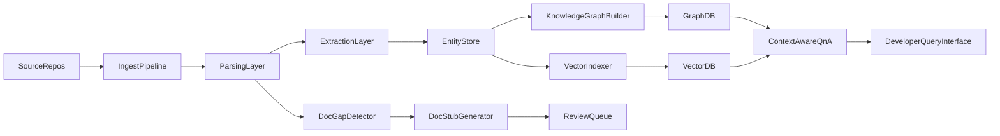

# Autonomous Knowledge Management for Development Teams  
## 1-Month Execution Plan (Utkrisht + Harsh)

## Project Objective
Build an intelligent knowledge management system that:
- Extracts architectural and implementation knowledge from code, docs, ADRs, and commits
- Constructs a queryable knowledge graph linking decisions to implementation
- Answers "why was this designed this way?" queries with grounded evidence
- Detects documentation gaps and generates targeted documentation stubs

---

## MVP Scope (Realistic for 1 Month)
Focus on **20-30 repositories** for a polished end-to-end demo:
- Multi-source ingestion (code, docs, commits, ADRs)
- Architectural entity extraction and linking
- Knowledge graph construction
- Semantic retrieval + rationale Q&A
- Documentation gap detection + stub generation

Scale to larger datasets after MVP is stable.

---

## System Flow

---

## Suggested Tech Stack
- **Language**: Python
- **Parsing**: Tree-sitter + lightweight regex fallback
- **Embeddings**: open-source code-text embedding model
- **Vector DB**: FAISS or Chroma
- **Knowledge Graph**: Neo4j (NetworkX for early prototyping)
- **Q&A**: RAG pipeline with source citations
- **Orchestration**: batch jobs + CLI scripts

---

## 4-Week Timeline

### Week 1: Data and Pipeline Foundation
- Finalize repository selection and success metrics
- Build ingestion for repositories, docs, commits, ADRs
- Define normalized schema (repo, file, symbol, commit, ADR, doc chunk)
- Output: reproducible dataset snapshot + parser baseline

### Week 2: Extraction and Knowledge Graph
- Implement architecture entity extraction (components, patterns, decisions)
- Build entity-linking from docs/ADRs/commits to code locations
- Define graph schema and edge provenance
- Populate graph for initial repositories
- Output: queryable graph with quality checks

### Week 3: Semantic Search and Why-Q&A
- Build hybrid retrieval (vector + metadata/graph constraints)
- Implement rationale Q&A with grounded citations
- Add CLI or simple web interface for developer queries
- Output: end-to-end retrieval + Q&A demo

### Week 4: Gap Detection, Generation, and Evaluation
- Build gap detector (complexity vs documentation coverage)
- Implement documentation stub generator
- Run evaluation and error analysis
- Prepare final report + demo
- Output: integrated MVP with measurable results

---

## Work Division

### Utkrisht (Data + Extraction + KG Lead)
- Repository ingestion and artifact normalization
- Architectural entity extraction pipeline
- Entity linking to code and commits
- Knowledge graph schema and build jobs
- Extraction/linking evaluation

### Harsh (Retrieval + Q&A + Gap Detection Lead)
- Embedding and retrieval index pipeline
- Why-Q&A engine with citation grounding
- Documentation gap detection
- Documentation stub generation
- Demo interface and user flow

### Shared
- Dataset curation and annotation guidelines
- Integration testing twice weekly
- Weekly failure analysis and prioritization
- Final presentation and report

---

## Weekly Collaboration Flow
- **Daily (15 min):** blockers, priorities, handoff
- **Twice weekly integration:** merge, regression checks, metric verification
- **Weekly review:** quality metrics, top failure cases, scope corrections

---

## Repository Structure
- `data_pipeline/`
- `extraction/`
- `knowledge_graph/`
- `retrieval_qa/`
- `doc_gap_generation/`
- `evaluation/`
- `demo/`

---

## Core Metrics to Track
- **Extraction:** Precision / Recall / F1 (architectural entities)
- **Linking:** decision-to-code Top-k accuracy
- **Retrieval:** Recall@k, MRR
- **Q&A:** citation correctness / groundedness score
- **Gap detection:** precision of true undocumented high-complexity modules
- **Generation:** human rating (correctness, usefulness, actionability)

---

## Month-End Deliverables
- Running MVP pipeline on selected repositories
- Knowledge graph with meaningful decision-code links
- Query interface for architecture rationale questions
- Documentation gap report + generated stubs
- Final technical report with metrics and roadmap

---

## Risk Register and Mitigation
- **Data heterogeneity across repos** -> enforce strict inclusion criteria and normalization
- **Weak decision-code linking** -> combine heuristics, embeddings, and commit signals
- **Hallucinated answers** -> enforce citation-grounded response policy
- **Scope overflow** -> prioritize one polished vertical slice over broad features

---

## Stretch Goals (Only If MVP Is Stable)
- Stale documentation detector
- Knowledge graph visualization dashboard
- Pattern recommendation engine for new changes
- Integration of team discussion channels (Slack/meeting notes)

