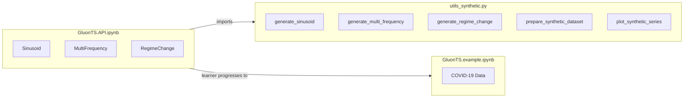
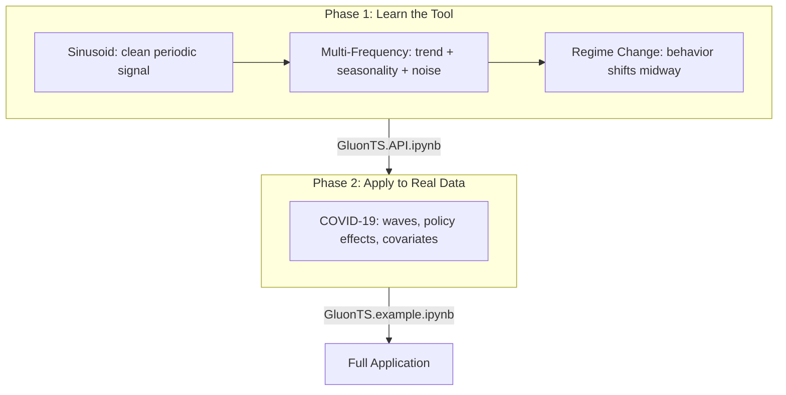

# PR 4 Plan: GluonTS Synthetic Data API Tutorial

## Overview

Rework `GluonTS.API.ipynb` to teach GluonTS fundamentals using progressively
complex synthetic data (replacing COVID data), create a dedicated
`utils_synthetic.py` for data generation, create `GluonTS.API.md`, and update
`README.md` and `blog_GluonTS.md` to reflect the new two-notebook structure.

---

## Current State

| What exists | Description |
|---|---|
| `GluonTS.API.ipynb` | Teaches DeepAR, SimpleFeedForward, DeepNPTS -- currently uses COVID-19 data |
| `GluonTS.example.ipynb` | Full end-to-end COVID application notebook |
| `GluonTS.example.md` | Companion doc for the example notebook |
| 9 `utils_*.py` files | All COVID-focused (data loading, preprocessing, models, evaluation, visualization) |
| `blog_GluonTS.md` | Blog post covering GluonTS + COVID |
| `README.md` | Setup guide, file listing, troubleshooting |
| No `GluonTS.API.md` | Missing (TorchRL tutorial has both `.ipynb` and `.md`) |
| No `utils_synthetic.py` | No synthetic data generation exists |

## Target State

| What changes | Description |
|---|---|
| `GluonTS.API.ipynb` | Uses **only synthetic data** to teach GluonTS fundamentals |
| `utils_synthetic.py` | **New** -- holds all synthetic data generation and preparation logic |
| `GluonTS.API.md` | **New** -- companion doc for the API notebook |
| `README.md` | Updated to describe the two-notebook learning path |
| `blog_GluonTS.md` | Updated to reference the new structure |
| `GluonTS.example.ipynb` | **Unchanged** -- COVID application stays as-is |
| All existing `utils_*.py` | **Unchanged** -- COVID pipeline intact |

---

## Architecture



## Learning Progression



---

## Commit-by-Commit Breakdown

### Commit 1: Create `utils_synthetic.py`

**New file:** `tutorials/GluonTS_COVID19_Prediction/utils_synthetic.py`

This is the backend for all synthetic data used in the API notebook.

**Functions to implement:**

| Function | Purpose | Returns |
|---|---|---|
| `generate_sinusoid(n_points, period, amplitude, noise_std, seed)` | Pure sine wave + Gaussian noise | DataFrame with `Date` and `value` columns |
| `generate_multi_frequency(n_points, seed)` | Slow linear trend + 30-day seasonal cycle + 7-day weekly cycle + noise | DataFrame with `Date` and `value` columns |
| `generate_regime_change(n_points, changepoint_frac, seed)` | Low-amplitude sinusoid in first half, higher amplitude / level shift after changepoint | DataFrame with `Date` and `value` columns |
| `prepare_synthetic_dataset(df, target_col, prediction_length, freq, context_length)` | Splits into train/test, converts to GluonTS `ListDataset` | Dict with `train_ds`, `test_ds`, `train_df`, `test_df`, metadata |
| `plot_synthetic_series(df, title)` | Quick matplotlib visualization of a generated series | matplotlib figure |

**Design principles:**

- All functions use `np.random.default_rng(seed)` for reproducibility
- DataFrames always have a `Date` column (daily freq from `2020-01-01`) and a
  `value` column, so they plug into existing `create_gluonts_dataset` from
  `utils_gluonts.py`
- `prepare_synthetic_dataset` reuses patterns from `utils_gluonts.py` but is
  self-contained (no COVID assumptions)
- No over-engineering, no unnecessary abstractions

**Dependencies:** Only numpy, pandas, matplotlib (already in `requirements.txt`)

---

### Commit 2: Rework `GluonTS.API.ipynb`

Strip out all COVID data loading. Replace with synthetic data. Restructure the
notebook into the following sections.

**Section 1: Introduction and Setup**

- What is GluonTS, what is probabilistic forecasting
- Imports: keep GluonTS model imports, replace `utils_notebook_loader` with
  `utils_synthetic`
- Explain why synthetic data first (clean signal, no domain distractions)

**Section 2: Synthetic Data -- Sinusoid (Simplest Case)**

- Generate sinusoid via `utils_synthetic.generate_sinusoid()`
- Visualize it with `utils_synthetic.plot_synthetic_series()`
- Convert to GluonTS `ListDataset` via `utils_synthetic.prepare_synthetic_dataset()`
- Explain the `ListDataset` format (`start`, `target`, `freq`) -- core API concept

**Section 3: DeepAR on Sinusoid**

- Configure DeepAR estimator with parameter table
- Train (`.train()`)
- Generate forecasts (`make_evaluation_predictions`)
- Visualize forecast with confidence intervals
- Evaluate with MAE, RMSE, MAPE
- Explain probabilistic output (confidence intervals, quantiles)

**Section 4: Harder Data -- Multi-Frequency**

- Generate multi-frequency series, visualize
- Train DeepAR on it, show how it handles more complexity
- Discussion: why `context_length` matters more here

**Section 5: SimpleFeedForward on Multi-Frequency**

- Same data, different model
- Compare to DeepAR results
- Discuss tradeoffs (speed vs accuracy)

**Section 6: Regime Change Data + DeepNPTS**

- Generate regime-change series, visualize
- Train DeepNPTS, show it handles the distribution shift
- Briefly show DeepAR on same data to contrast
- Discuss why DeepNPTS shines on non-stationary data

**Section 7: Model Comparison Summary**

- Side-by-side metrics table across all experiments
- Which model for which pattern type
- Bridge: "Now that you understand the tools, see `GluonTS.example.ipynb` for
  a real-world COVID-19 application"

**Notebook code style:**

- Minimal code per cell (1-5 lines calling utils functions)
- Markdown cells do the teaching
- Consistent 5-step workflow for each model: configure, train, forecast,
  visualize, evaluate

---

### Commit 3: Create `GluonTS.API.md`

**New file:** `tutorials/GluonTS_COVID19_Prediction/GluonTS.API.md`

Companion documentation for the API notebook, following the pattern of
`TorchRL_MAC.API.md`. Contents:

- Goal of the tutorial
- Project structure (which file does what)
- Synthetic data progression and rationale
  - Sinusoid: baseline periodic pattern
  - Multi-frequency: trend + seasonality + noise (more realistic)
  - Regime change: non-stationary behavior
- The three models and when to use each
  - DeepAR: complex seasonality, long-term dependencies
  - SimpleFeedForward: fast baselines, stable trends
  - DeepNPTS: regime shifts, unusual distributions
- How to run the notebook
- Link to `GluonTS.example.ipynb` for the real-world application

---

### Commit 4: Update `README.md`

Update `tutorials/GluonTS_COVID19_Prediction/README.md` to:

- Follow the Autogen README pattern (concise quick-start with ordered notebook
  progression)
- Add learning path guidance:
  1. Start with `GluonTS.API.ipynb` (fundamentals with synthetic data)
  2. Then `GluonTS.example.ipynb` (real-world COVID application)
- Update "Files and Structure" section to include:
  - `utils_synthetic.py` -- synthetic data generation
  - `GluonTS.API.md` -- API notebook documentation
- Keep troubleshooting and Docker sections as-is

---

### Commit 5: Update `blog_GluonTS.md`

Update `tutorials/GluonTS_COVID19_Prediction/blog_GluonTS.md` to:

- Mention the new synthetic-data-first learning path
- Add a section on why synthetic data helps learners (clean signals, no domain
  complexity, progressive difficulty)
- Reference both notebooks in the "getting started" flow
- Keep existing COVID content intact

---

## Files NOT Modified

| File | Reason |
|---|---|
| `GluonTS.example.ipynb` | COVID application stays as-is |
| `GluonTS.example.md` | Companion doc for example, no changes needed |
| `utils_data_download.py` | COVID data pipeline |
| `utils_data_io.py` | COVID data loading |
| `utils_preprocessing.py` | COVID feature engineering |
| `utils_analysis.py` | COVID data quality checks |
| `utils_gluonts.py` | GluonTS dataset creation (may be reused by `utils_synthetic.py`) |
| `utils_models.py` | COVID model training |
| `utils_evaluation.py` | Metrics and evaluation |
| `utils_visualization.py` | COVID-specific plots |
| `utils_notebook_loader.py` | COVID quick loader |
| `Dockerfile` | No new system deps |
| `requirements.txt` | numpy, pandas, matplotlib already present |
| `docker_*.sh` | No changes needed |

---

## Risks and Mitigations

| Risk | Mitigation |
|---|---|
| Synthetic data too trivial for models | Three-level progression ensures meaningful patterns; regime change tests real model capabilities |
| Notebook becomes too long | Keep code cells to 1-5 lines (logic in `utils_synthetic.py`); markdown does the teaching |
| Breaking existing COVID pipeline | Not touching any existing utils or the example notebook |
| Inconsistent data format | All synthetic generators return identical DataFrame schema (`Date`, `value`) compatible with `create_gluonts_dataset` |

---

## Reference: Standard Tutorial Structure (from GP)

Based on the TorchRL_MAC and Autogen tutorials, the standard file structure is:

```
tutorial_dir/
  README.md
  Dockerfile
  docker_build.sh / docker_bash.sh / docker_jupyter.sh
  requirements.txt
  XYZ_utils.py          (or utils_*.py)
  XYZ.API.ipynb
  XYZ.API.md
  XYZ.example.ipynb
  XYZ.example.md
  blog_XYZ.md
```

After this PR, our GluonTS tutorial will match this structure with the addition
of `utils_synthetic.py` for the API notebook's data needs.
