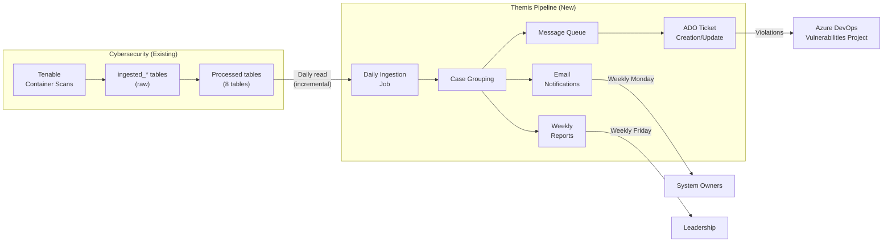
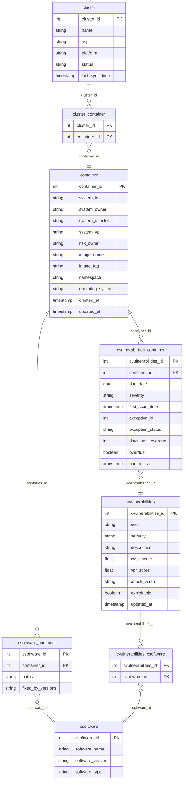
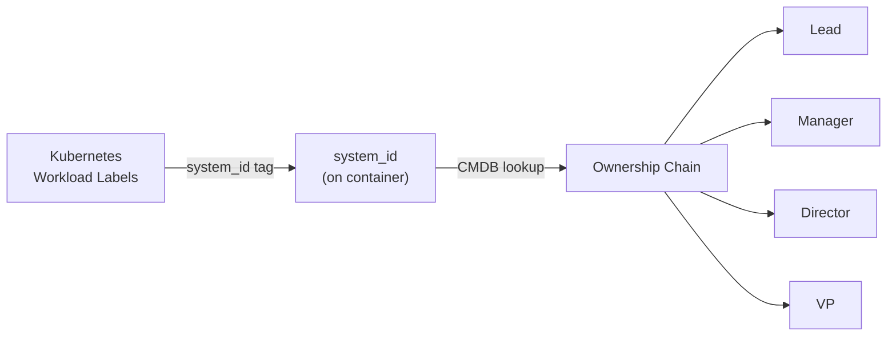
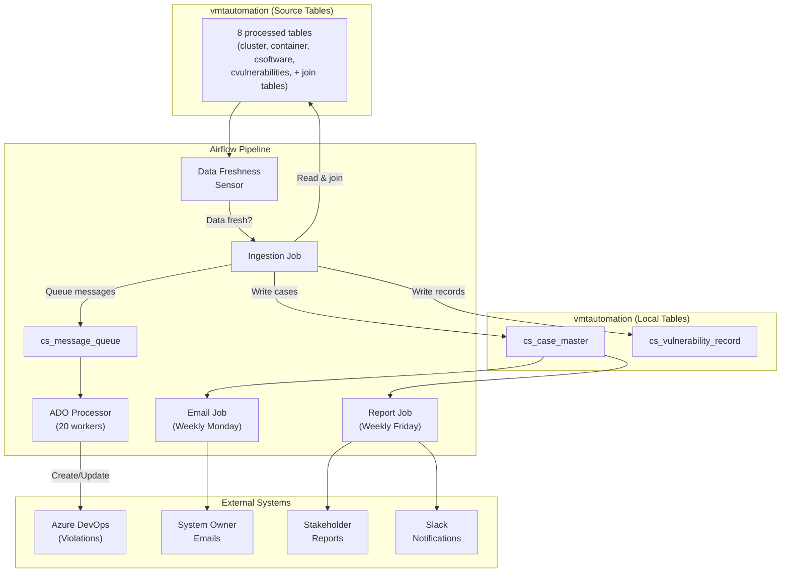

# Container Scan Vulnerability Management - Technical Overview

**Document Type:** Technical Reference (for Cyber & UPM Ops teams)  
**Version:** 1.0  
**Author:** Harsh Yadav (Themis / Mycroft)  
**Date:** January 28, 2026  
**Audience:** Cybersecurity team (Silpa, Salim, Prashant), UPM Operations (Arnaud, Adam, Gina)

---

## 1. Project Objective

Build an automated pipeline that reads container vulnerability data from the `vmtautomation` database, groups vulnerabilities into cases, creates and manages ADO work items to track remediation, and sends email notifications to system owners based on SLA deadlines.

This system follows the same pattern as the existing NYDFS Vulnerability Management pipeline but operates on container-specific data from Tenable container scans.

### High-Level Pipeline



---

## 2. Data Source

| Aspect | Details |
|--------|---------|
| Scanner | Tenable (container scanning module) |
| Database | `vmtautomation` (PostgreSQL) |
| Refresh cadence | Daily (same schedule as NYDFS VM) |
| Tables we read from | 8 processed tables (see Section 3) |
| Tables we do NOT read from | `ingested_*` tables (raw/unprocessed, managed by Cyber) |

---

## 3. Source Database Schema

### 3.1 Complete Data Model

All 8 processed tables and their relationships, verified from Dev environment data exports:



### 3.2 Table Summary

| Table | PK | Dev Rows | Purpose |
|-------|-----|----------|---------|
| `cluster` | `cluster_id` | 78 | All Kubernetes clusters Tenable is scanning |
| `cluster_container` | `(cluster_id, container_id)` | 9,784 | Join table: which containers run on which clusters |
| `container` | `container_id` | 4,218 | All scanned containers with ownership and image info |
| `csoftware` | `csoftware_id` | 2,882 | Software bill of materials across all containers |
| `csoftware_container` | `(csoftware_id, container_id)` | 46,139 | Join table: which software is installed on which container |
| `cvulnerabilities` | `cvulnerabilities_id` | 9,750 | All vulnerability definitions (CVEs, CVSS scores, etc.) |
| `cvulnerabilities_container` | `(cvulnerabilities_id, container_id)` | 386,986 | Join table: which vulns affect which containers (includes due_date, severity, SLA fields) |
| `cvulnerabilities_csoftware` | `(cvulnerabilities_id, csoftware_id)` | 20,988 | Join table: which vulns are tied to which software packages |

### 3.3 Key Relationships

All four relationship paths are confirmed and available:

| Relationship | Join Path | Coverage |
|-------------|-----------|----------|
| Cluster to Container | `cluster` -> `cluster_container` -> `container` | 94.9% of containers |
| Container to Software | `container` -> `csoftware_container` -> `csoftware` | Full |
| Container to Vulnerability | `container` -> `cvulnerabilities_container` -> `cvulnerabilities` | Full |
| Vulnerability to Software | `cvulnerabilities` -> `cvulnerabilities_csoftware` -> `csoftware` | 20,988 links |

### 3.4 Full Join Path for Ticket Creation

Starting from `cvulnerabilities_container` (the primary working table with SLA fields), we can traverse the full chain:

```
cvulnerabilities_container             -- Starting point (due_date, severity, SLA fields)
    |
    |-- cvulnerabilities_id --> cvulnerabilities               -- CVE details, CVSS score
    |                               |
    |                               |-- cvulnerabilities_csoftware --> csoftware  -- Affected software
    |
    |-- container_id -----------> container                    -- Ownership (system_owner), image info
                                    |
                                    |-- cluster_container --> cluster           -- Cluster name, platform
                                    |
                                    |-- csoftware_container --> csoftware       -- All installed software
```

This allows us to tell a system owner: **"This vulnerability (CVE-XXXX) affects this specific software package (openssl 1.1.1) running in this container (payment-service) on this cluster (prod-east-01), and it is due for remediation by this date."**

---

## 4. Data Quality Observations (from Dev)

### 4.1 Severity Distribution

Based on 386,986 vulnerability-container records:

| Severity | Count | % |
|----------|-------|---|
| Medium | 285,865 | 73.9% |
| Low | 89,185 | 23.0% |
| High | 5,393 | 1.4% |
| Critical | 1,031 | 0.3% |
| Informational | 268 | 0.07% |
| NULL | 5,244 | 1.4% |

### 4.2 Ownership Coverage

Based on 4,218 containers:

| Field | Populated | % | Notes |
|-------|-----------|---|-------|
| `system_id` | 3,298 | 78% | From Kubernetes labels |
| `system_owner` | 3,276 | 78% | Display name (e.g., "Peter Tang") |
| `risk_owner` | 2,870 | 68% | May differ from system_owner |

**22% of containers have no identified owner.** This happens when Kubernetes workloads don't include `system_id` tags.

### 4.3 SLA Field Coverage

| Field | Populated | % |
|-------|-----------|---|
| `due_date` | 381,742 | 98.6% |
| `severity` | 381,742 | 98.6% |

---

## 5. Pipeline Processing Logic

### 5.1 Daily Ingestion

1. **Read** new/updated records from source tables (filtered by processing date)
2. **Join** across the 8 tables to build a complete picture per vulnerability-container pair
3. **Group** vulnerabilities into cases (see Section 5.2)
4. **Create/Update** case master records in our local processing tables
5. **Queue** ADO messages (CREATE or UPDATE) for each case

### 5.2 Vulnerability Grouping (Proposed -- Needs Confirmation)

Vulnerabilities are grouped into a single ADO ticket (case) when they share the same:

| Grouping Field | Source Table | Notes |
|----------------|-------------|-------|
| `container_id` | `cvulnerabilities_container` | Which container |
| `system_owner` | `container` | Who owns it (for ticket assignment) |
| `severity` | `cvulnerabilities_container` | Critical / High / Medium / Low |
| `due_date` | `cvulnerabilities_container` | Remediation deadline |

**Open question:** Should `cluster_id` also be part of the grouping key? This would split tickets further if the same container image runs on multiple clusters.

**For comparison**, NYDFS VM groups by: `(system_entry_id, risk_owner, solution_category, severity, due_date)`

### 5.3 ADO Ticket Creation

Each case becomes one ADO work item (Violation) with:

| ADO Field | Source | Example |
|-----------|--------|---------|
| Title | Composed from grouping fields | `High - Cluster: prod-east-01 - Container: payment-service - Owner: Jane Doe - Due: 03/15/2026` |
| Assigned To | `system_owner` (resolved to email) | jane.doe@geico.com |
| Due Date | `cvulnerabilities_container.due_date` | 2026-03-15 |
| Target Date | Initially same as due date, can change with exceptions | 2026-03-15 |
| Risk | Mapped from severity | High |
| Area Path | TBD (same as NYDFS or separate) | `Vulnerabilities\ContainerScan\{owner}` |
| Description | HTML template with cluster, container, software, and vulnerability details | See Section 5.4 |

### 5.4 Sample ADO Ticket Content

**Title:** `High - Cluster: prod-east-01 - Container: payment-service - Owner: Jane Doe - Due: 03/15/2026`

**Description:**
```
Cluster:    prod-east-01
Container:  payment-service
Image:      payment-service:v3.2.1
Namespace:  production
OS:         Alpine Linux 3.18

Affected Software (3 packages):
+-------------+---------+----------------+
| Software    | Version | Vulnerabilities|
+-------------+---------+----------------+
| openssl     | 1.1.1   | 3              |
| nginx       | 1.21.0  | 1              |
| python      | 3.9.7   | 2              |
+-------------+---------+----------------+

Total Vulnerabilities: 6

For detailed information, refer to the Tenable Dashboard or the Resources tab.
```

### 5.5 SLA Management

Remediation SLAs (same as NYDFS VM, pending confirmation):

| Severity | Remediation Window |
|----------|-------------------|
| Critical | 30 days |
| High | 60 days |
| Medium | 90 days |
| Low | 365 days |

Due dates are pre-calculated in `cvulnerabilities_container.due_date` by the Cyber team (98.6% populated). Our system tracks SLA compliance and flags overdue items.

### 5.6 Email Notifications

Automated emails are sent every **Monday** to system owners if at least one of these criteria is met:

- One or more vulnerabilities are **past due**
- One or more vulnerabilities are **coming due within 14 days** (any severity)
- One or more vulnerabilities are **coming due within 30 days** (High or Medium only)

Emails include a summary of the owner's open cases with links to ADO work items.

### 5.7 Weekly Reports

Generated every **Friday** and sent to stakeholders (Miro Halas, Mike Lucas, Leo Nagata, Roberto Bouza). Reports include:

- Total open/closed/overdue cases
- Severity breakdown
- Top owners by case count
- SLA compliance metrics

---

## 6. Ownership Model

### 6.1 How Ownership is Determined



- `system_id` is a Kubernetes label applied to each workload
- If the workload does not include a `system_id` tag, ownership fields are **null** (22% of containers)
- CMDB (Federated CMDB) is used to resolve `system_id` into the full ownership chain
- The `system_owner` field in the `container` table contains the owner's **display name** (not email)

### 6.2 Handling Missing Ownership

- Vulnerabilities on containers with **no owner** will still be ingested and tracked
- **No ADO tickets or notifications** will be sent for unowned containers (no one to assign to)
- These are reported in the weekly stakeholder report to highlight ownership gaps

### 6.3 Email Resolution (Needs Clarification)

`system_owner` contains a display name (e.g., "Peter Tang"), not an email address. We need a way to resolve this to an email for ADO ticket assignment and email notifications.

**Possible approaches (need confirmation from Cyber):**
- `cmdb_ownership_cache` table in `vmtautomation` (if it contains email mappings)
- `employee` table in `vmtautomation` (if it's a general directory)
- MS Graph API (name-to-email lookup, same as NYDFS VM)

---

## 7. Pending Schema Changes

The Cyber team has indicated that some fields will be moved between tables. **Timelines are TBD (Silpa to confirm with Prashant).**

| Field | Current Location | Future Location | Impact |
|-------|------------------|-----------------|--------|
| `system_owner` | `container` | `cluster_container` | Our ingestion query will need to read ownership from a different table |
| `system_id` | `container` | `cluster` | Same - query change needed |

**Our approach:** Build against the current schema and adapt when changes are deployed. The ingestion query is isolated in one module, making the switch straightforward.

---

## 8. Comparison with NYDFS VM Pipeline

| Aspect | NYDFS Vulnerability Management | Container Scan (New) |
|--------|-------------------------------|---------------------|
| Data source | Single table (`vulnerability_findings_enriched`) | 8 joined tables |
| Entity tracked | Host / Server (asset) | Container (on Kubernetes cluster) |
| Grouping key | `system_entry_id + risk_owner + solution_category + severity + due_date` | `container_id + system_owner + severity + due_date` (proposed) |
| Owner field | `risk_owner` | `system_owner` (display name, not email) |
| Ownership lookup | MS Graph (name to email) | TBD (CMDB / MS Graph / employee table) |
| Due date source | Calculated from severity + first_seen | Pre-calculated in data (98.6% populated) |
| Severity source | `geico_severity` field | `severity` in `cvulnerabilities_container` |
| Daily checkpoint | `day` column | `updated_at` or `processed_day` (TBD) |
| Scan frequency | Daily | Daily |
| SLA thresholds | Critical: 30d, High: 60d, Medium: 90d, Low: 365d | Same (pending confirmation) |
| ADO project | Vulnerabilities | Same or separate (pending confirmation) |
| Work item type | Violations | Same (pending confirmation) |

---

## 9. Open Questions Requiring Input

### For Cybersecurity Team (Silpa / Salim)

| # | Question | Why It Matters | Priority |
|---|----------|----------------|----------|
| 1 | **What are the exact grouping fields** for creating ADO tickets? We propose `(container_id, system_owner, severity, due_date)`. Should `cluster_id` be included? Is there a `solution` equivalent? | Determines how many tickets are created and how they're structured | **High** |
| 2 | **What field do we filter on for incremental daily processing?** Is it `cvulnerabilities_container.updated_at`, a `processed_day` column, or something else? | We need to pull only new/changed records daily, not all 387K rows | **High** |
| 3 | **Can we use `cmdb_ownership_cache` or `employee` table** to resolve `system_owner` (display name) to an email address? | Needed for ADO ticket assignment and email notifications | **High** |
| 4 | **How do we know when a vulnerability is fixed?** Is the record removed from `cvulnerabilities_container`, or is there a status field? | Determines how we close ADO tickets | Medium |
| 5 | **How should we handle the `exception` fields?** (`exception_id`, `exception_status` on `cvulnerabilities_container`) Should we skip vulns with active exceptions, or create tickets but tag them? | Affects SLA tracking and ticket creation logic | Medium |
| 6 | **When will `system_owner` move from `container` to `cluster_container`?** Are there other planned column changes? | We'll build for the current schema but need to know when to adapt | Medium |
| 7 | **Is `due_date` pre-calculated by your team**, or should we calculate it from `first_scan_time` + SLA? ~1.4% of records have null `due_date` -- is that expected? | Affects whether we trust the field or compute our own | Low |

### For UPM Operations (Arnaud)

| # | Question | Why It Matters | Priority |
|---|----------|----------------|----------|
| 8 | **Area path:** Same `Vulnerabilities` project as NYDFS VM, or a separate area path for container scans? | Determines ADO project structure and access control | **High** |
| 9 | **Work item type:** Should tickets be "Violations" (same as VM) or a different type? | Affects ticket template and workflow | **High** |
| 10 | **SLAs:** Same as NYDFS VM (Critical: 30d, High: 60d, Medium: 90d, Low: 365d)? | Affects SLA tracking and notification triggers | **High** |
| 11 | **Stakeholder audience for weekly reports:** Same group (Miro, Mike, Leo, Roberto) or different? | Determines email distribution list | Low |

---

## 10. Current Project Status

| Milestone | Status |
|-----------|--------|
| Requirements gathering & meeting with Cyber team | Complete |
| Dev data export & analysis (all 8 tables) | Complete |
| Data model verification (all relationships confirmed) | Complete |
| Project directory & local infrastructure setup | Complete (merged to main) |
| Local Postgres with sample data, pgAdmin, Airflow | Complete |
| Configuration & environment management | Not started |
| Ingestion job (data fetch, join, grouping) | Not started (blocked on questions 1-2) |
| ADO client & ticket creation | Not started (blocked on questions 8-9) |
| Email notifications | Not started (blocked on question 3) |
| Weekly reports | Not started |

---

## Appendix A: Local Processing Tables

In addition to reading from the 8 source tables, our pipeline maintains its own processing tables in `vmtautomation`:

| Table | Purpose |
|-------|---------|
| `cs_case_master` | One row per case (grouped set of vulnerabilities). Tracks ADO work item ID, status, owner, severity. |
| `cs_vulnerability_record` | One row per vulnerability-container pair assigned to a case. Links back to `cs_case_master`. |
| `cs_message_queue` | ADO message queue. Each row is a CREATE or UPDATE message to be processed by the ADO worker. |

## Appendix B: System Architecture


